<p align="center">
  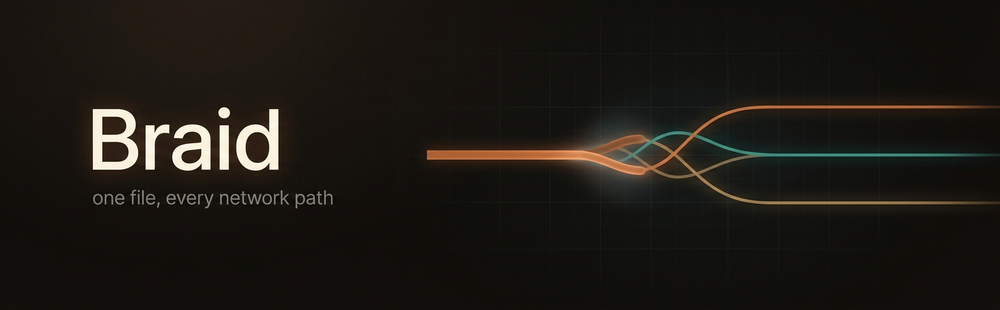
</p>

<p align="center">
  <b>A download manager that splits one file across every network path you have.</b><br>
  Wi-Fi, Ethernet and a tethered phone, pulling the same file at once, reassembled exactly.
</p>

<p align="center">
  <a href="#install">Install</a> &middot;
  <a href="#what-it-does">What it does</a> &middot;
  <a href="#ways-to-connect">Ways to connect</a> &middot;
  <a href="#the-android-companion">Phones</a> &middot;
  <a href="#how-it-works">How it works</a> &middot;
  <a href="https://www.infodivelabs.com/products/braid">Website</a> &middot;
  <a href="https://www.infodivelabs.com/products/braid/docs">Docs</a>
</p>

<p align="center">
  
  
  
  
</p>

---

## What it does

<table>
<tr>
<td width="50%" valign="top">

### Uses every path at once

Wi-Fi, Ethernet and a phone's mobile data pulling **one file together**. Each
connection is bound to a chosen interface, not left to the routing table.

Slow paths get fewer chunks. A path that dies has its work moved. The sidebar
shows what each one is actually carrying, so a path contributing nothing is
visibly contributing nothing.

</td>
<td width="50%" valign="top">
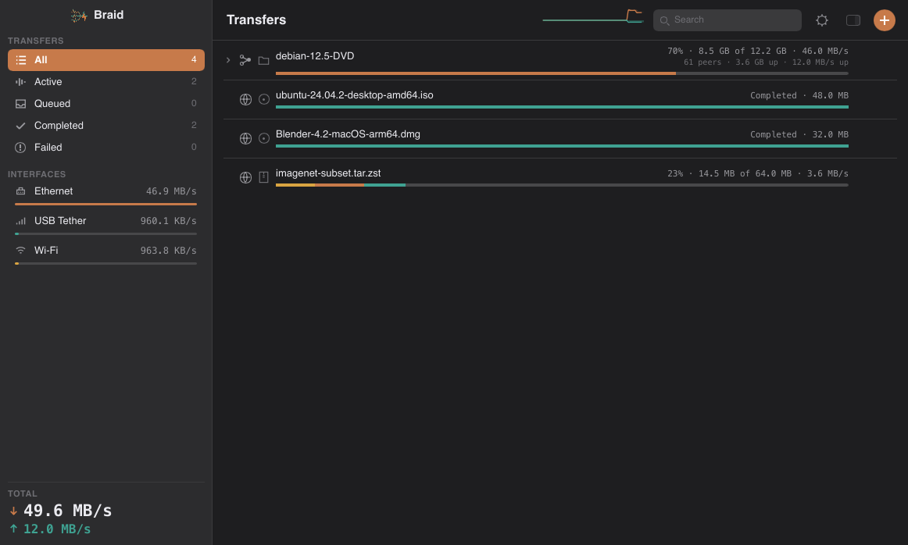<br>
<sub><i>A scripted demonstration, not a live desktop.
<a href="#screens">What is simulated</a>.</i></sub>
</td>
</tr>

<tr>
<td width="50%" valign="top">
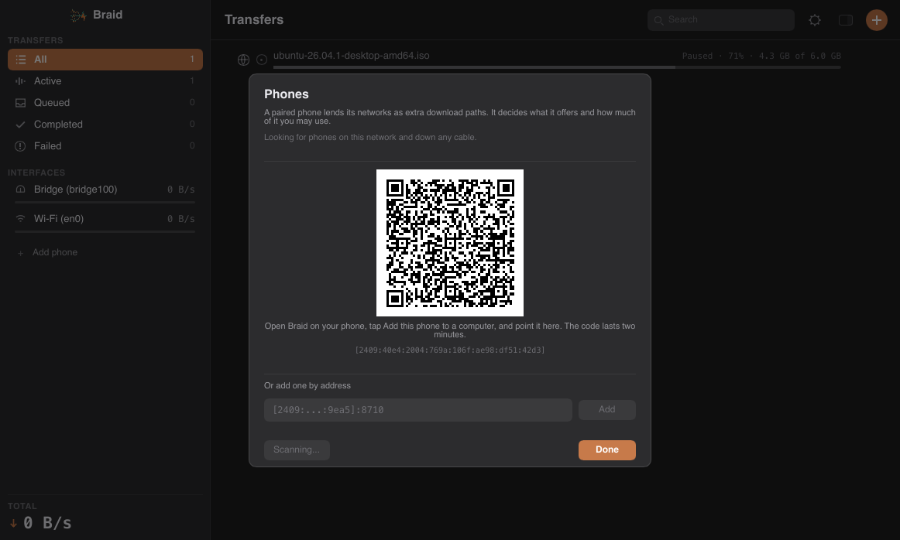
</td>
<td width="50%" valign="top">

### Borrows your phone's connection

Press **Add phone**, then **Show code**, and point the phone at the screen.
Nothing typed, no discovery to fail.

The phone decides what it lends and how much it will spend. Switch mobile
sharing on there and the path appears here by itself.

</td>
</tr>

<tr>
<td width="50%" valign="top">

### Does not corrupt files

Every chunk is hashed as it lands, and the journal records it as durable only
**after** its bytes are. A crash costs the bytes in flight, never the file.

It also refuses the failures that quietly produce a wrong file: a server that
advertises `Range` and ignores it, a `200` where a `206` was asked for, a login
page with a plausible `Content-Length`.

</td>
<td width="50%" valign="top">
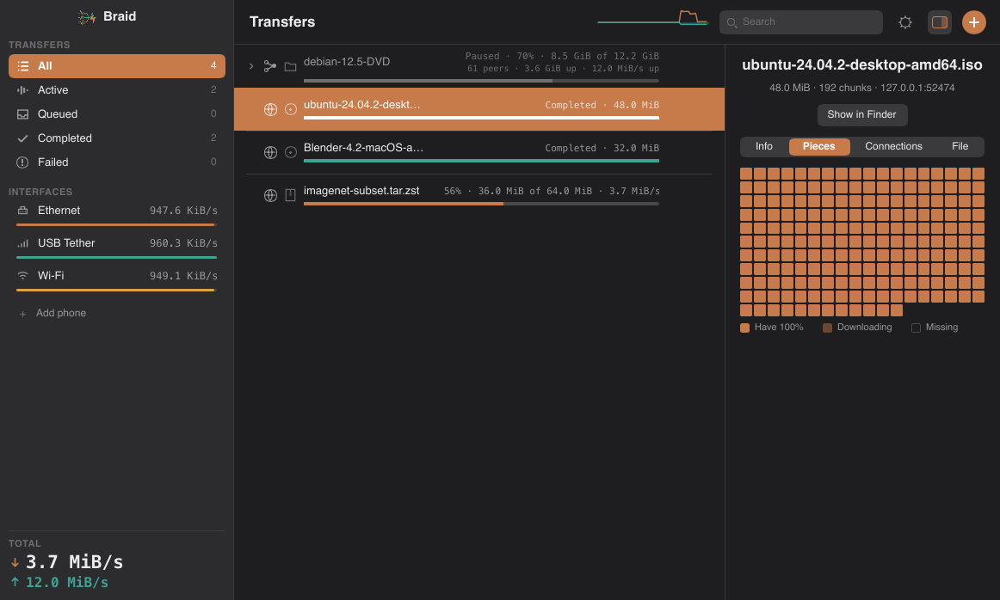
</td>
</tr>

<tr>
<td width="50%" valign="top">
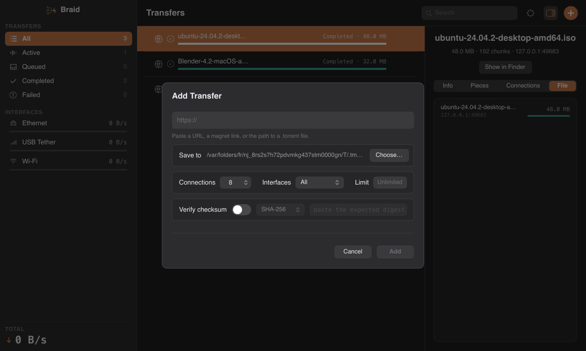
</td>
<td width="50%" valign="top">

### Speaks BitTorrent, and survives expiring links

Magnet links and `.torrent` files in the same list, with per-file progress,
peers and seeding. A client, not an index: no search, no bundled trackers.

Pre-signed URLs are re-resolved before they lapse. Sixteen connections hitting
a dead link produce exactly one refresh.

</td>
</tr>

<tr>
<td width="50%" valign="top">

### Runs on a server, in place of qBittorrent

One container where most stacks run a torrent client plus a shell script with
`curl` in it. Braid answers qBittorrent's own API, so Sonarr, Radarr and
Prowlarr drive it by changing four fields in the client they already have.

The direct-download half is the part that script never did properly: resume
across restarts, a hash per chunk, and expiring links re-signed before they
lapse.

</td>
<td width="50%" valign="top">
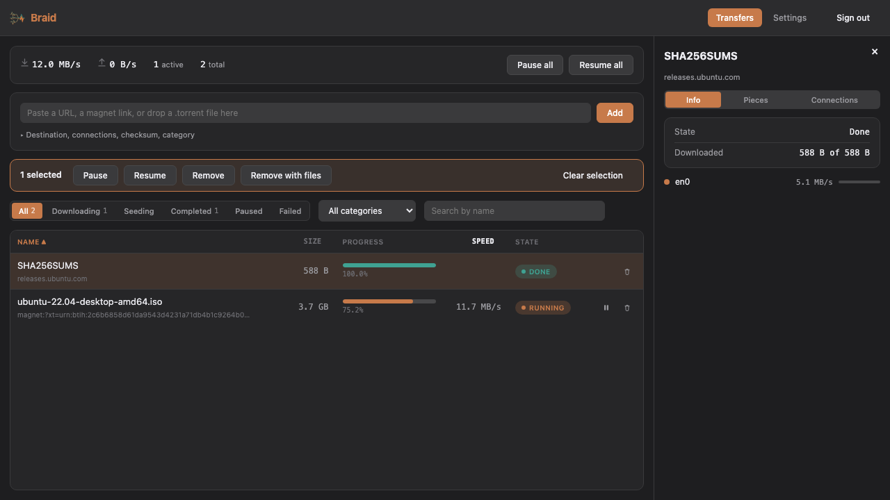
</td>
</tr>
</table>

---

## Ways to connect

<p align="center">
  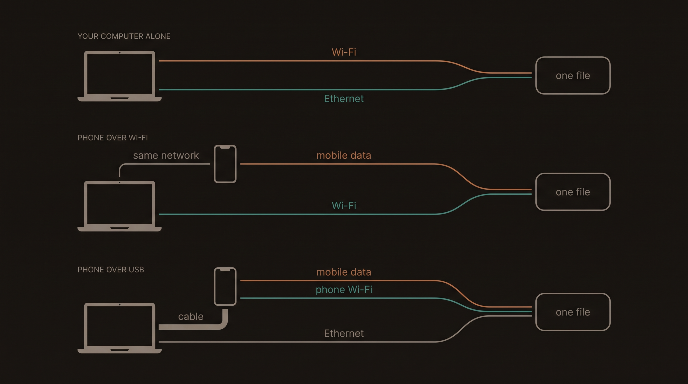
</p>

| Setup | What carries the file | Companion |
|---|---|:--:|
| Computer alone | Every interface you select | no |
| Plain USB tethering | The phone appears as one network card | no |
| Phone on your network | Your connection **plus** its mobile data | yes |
| Phone on a cable | Your connection **plus** its mobile data **plus** its Wi-Fi | yes |
| Several phones | Every network of every phone, weighted independently | yes |

> **A phone on your Wi-Fi is usually not a second path.** If it reaches the internet
> through the same router you do, it is your own connection wearing a second name.
> Braid compares the address each path leaves from and marks that one *Not used*
> rather than pretending. Its mobile data is a real second path; its Wi-Fi is not.

> **A phone joins the next transfer, not one already running.** A transfer's paths are
> fixed when it starts. Pair first, then download.

---

## The Android companion

The phone forwards; the desktop downloads. The phone never stores, verifies or resumes
anything, so every hard problem stays where it is already solved.

**Braid for Android 0.1.1** is a signed APK from
[InfoDiveLabs/braid-android](https://github.com/InfoDiveLabs/braid-android).
One build for every architecture, since it carries no native code.

| | |
|---|---|
| Requires | Android 8.0 or newer |
| Download | `braid-android-0.1.1.apk`, 511 KiB, with `SHA256SUMS` |
| Signing key | `04:C0:0D:53:6A:D1:DB:AD:25:90:C8:43:3C:41:6B:EA:6A:66:4C:9E:2B:4C:B6:E5:49:C2:4F:80:B5:08:77:E2` |

The signing certificate above is the same for every future release: an APK that does
not match it did not come from us. Setup, pairing and troubleshooting are in the
[docs](https://www.infodivelabs.com/products/braid/docs#add-a-phone).

Checked on a Pixel 7 Pro against a real carrier: a socket bound to the cellular radio
genuinely leaves by it, per-path session limits cut a lane when they are reached,
sharing survives the screen locking and Doze, and pairing by code works end to end.

---

## Run it on a server

<p align="center">
  
</p>

`braid-server` is the same engine with no window: a container, a web UI, and an
API. It exists because a media stack usually runs a torrent client **and**
something else for direct downloads, and the something else is a shell script
with `curl` in it.

**It answers qBittorrent's API.** Point Sonarr, Radarr, Prowlarr or Lidarr at it
by changing the host, port, username and password on the qBittorrent client they
already have. Leave the category alone: that is how each app finds its own
downloads again, and Braid keeps it across restarts.

```yaml
services:
  braid:
    image: ghcr.io/infodivelabs/braid:latest
    ports: ["8080:8080", "6881:6881", "6881:6881/udp"]
    volumes: ["./config:/config", "./downloads:/downloads"]
    environment: [PUID=1000, PGID=1000]
```

The admin password is generated on first start and printed once to the log. Full
instructions, including the migration, are in [`docker/README.md`](docker/README.md).

Verified against a real Sonarr 4.0.20 and Radarr 6.4.4, from grab to library
import. The API surface those clients need is covered;
[`harness/README.md`](harness/README.md) lists what is not.

To build it yourself: `cargo build --release -p dl-server`, or
`docker build -f docker/Dockerfile .` for the image.

---

## Screens

<table>
<tr>
<td width="50%">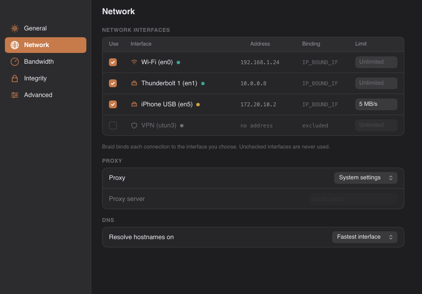<br>
<b>Your interfaces, and how they are bound.</b> The Binding column shows the mechanism
actually in force, so a silent fall back to a source-address bind is visible rather
than assumed.</td>
<td width="50%">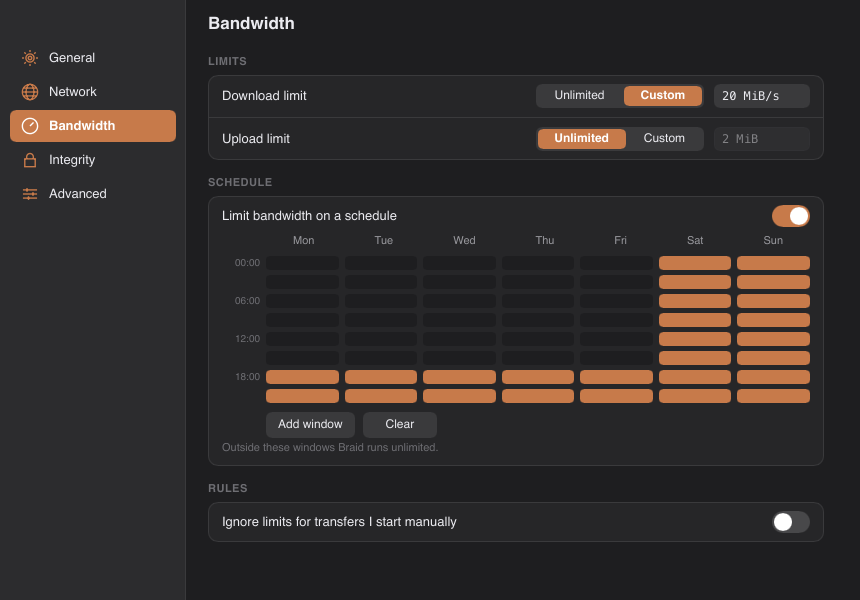<br>
<b>Limits that know what time it is.</b> Paint the hours you want capped. The schedule
reaches a running transfer, not just the next one.</td>
</tr>
</table>

<p align="center">
  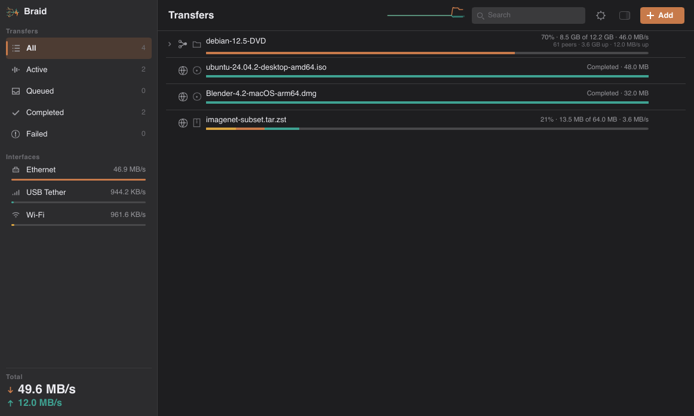<br>
  <i>One application, native to each desktop: one Slint UI, per-platform metrics and
  selection styling.</i>
</p>

<details>
<summary><b>What is staged in these images</b></summary>

Every image is the running application: real interface, real engine, real transfers
with real chunking and a real journal. Two things are staged, and both are named here
rather than left for you to find.

- **The three network interfaces are one.** The machine these were captured on has a
  single routable interface. Wi-Fi, Ethernet and USB Tether are three connections over
  loopback wearing those labels, so the part of the interface built to display
  aggregation has something to display.
- **The torrent's swarm is simulated.** Its peers, throughput and file list come from a
  stand-in backend.

The pairing screen is the exception: the real application, driven to that screen and
captured there, showing a genuine code for the machine it was taken on. The transfers
are genuine downloads against a local test server, which is why the inspector reads
`127.0.0.1`.

</details>

---

## Install

Grab the installer for your platform from
[Releases](https://github.com/InfoDiveLabs/braid/releases). Both the desktop
application (`braid`) and the command-line tool (`dl`) are installed.

| Platform | File | Notes |
|---|---|---|
| macOS 11+ | `Braid-x.y.z-macos.dmg` | Unsigned: first launch needs right-click, then Open |
| Debian, Ubuntu | `braid_x.y.z_amd64.deb` | `sudo apt install ./braid_*.deb` |
| Fedora, RHEL | `braid-x.y.z.x86_64.rpm` | `sudo dnf install ./braid-*.rpm` |
| Windows 10+ | `braid-x.y.z.msi` | Multi-NIC is unverified on hardware |
| Android 8+ | `braid-android-x.y.z.apk` | The companion, from [braid-android](https://github.com/InfoDiveLabs/braid-android) |

```console
$ dl add https://releases.ubuntu.com/24.04/ubuntu-24.04-desktop-amd64.iso \
     --connections 8 --verify sha256:9d3f...
```

---

## How it works

<p align="center">
  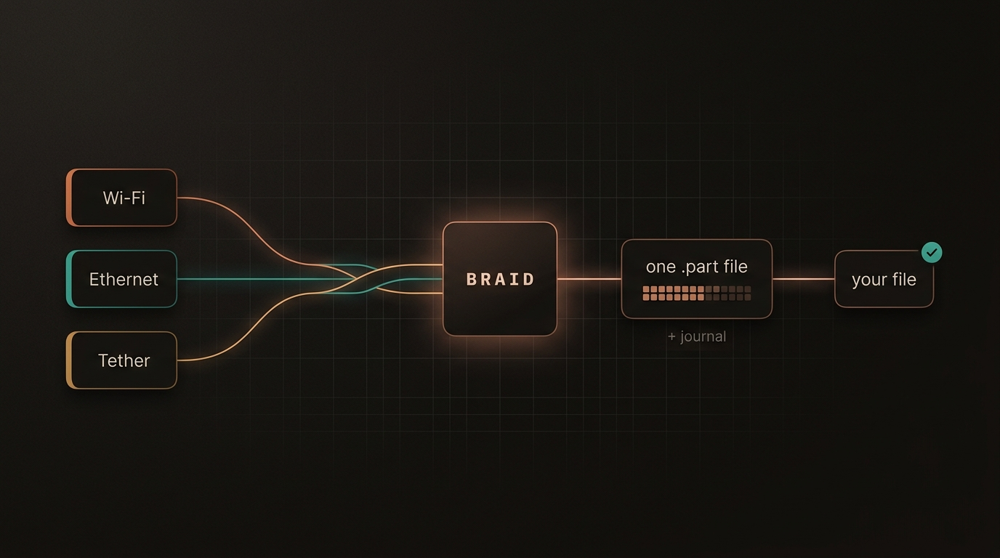
</p>

A transfer is split into chunks and handed to whichever path is fastest **right now**,
measured rather than assumed. One writer puts them into a single preallocated file.

> Chunk data is made durable **before** the journal claims the chunk.

That ordering is the whole design. Break it and resume trusts bytes that were never
written, producing a corrupt file that looks complete. Every durability mode keeps it;
they differ only in how often the pair happens.

| Mode | Flushes | Journal |
|---|---|---|
| Safe | every chunk | waits for the drive |
| Balanced | 5 s or 64 MiB | waits for the drive |
| Fast | 30 s or 512 MiB | leaves it to the OS |

---

## Torrents, and the law

Braid is a BitTorrent client, not an index. No search, no bundled tracker list, no
content directory, and there will not be. That line is deliberate: clients are lawful,
and the cases that were not involved supplying somewhere to find infringing material.

**Seeding is publication.** Joining a swarm announces your address to every peer and
tracker in it. Binding a transfer to an interface is **not** a privacy control.

## Building it

```console
$ cargo build --release            # both binaries
$ cargo test --workspace           # 507 tests
$ cargo run -p xtask -- package    # the host platform's installer
```

Rust 1.92 or newer. Linux also needs `libxkbcommon-dev` and `libfontconfig-dev`.

[DEVELOPMENT.md](DEVELOPMENT.md) covers the layout, the invariants worth knowing before
touching storage, how one source builds three desktops, and what is not verified.
[CONTRIBUTING.md](CONTRIBUTING.md) covers the bar for a change.

## Licence

Copyright (C) 2026 [InfoDive Labs Pvt Ltd.](https://www.infodivelabs.com)
Written by Suraj Tiwari.

Braid is free software: you can redistribute it and modify it under the terms of the
GNU General Public License version 3, as published by the Free Software Foundation. It
is distributed in the hope that it will be useful, but WITHOUT ANY WARRANTY, without
even the implied warranty of MERCHANTABILITY or FITNESS FOR A PARTICULAR PURPOSE. See
[LICENSE](LICENSE) for the full terms.
